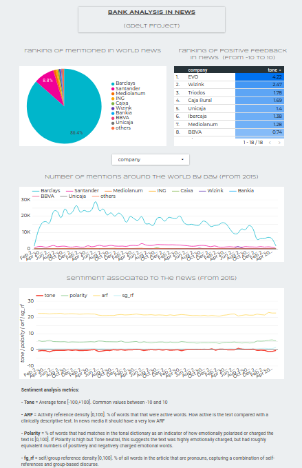

# Bank Analysis.

I was thinking on opening a new bank account and in the way i thought "damn, I could analyse the sentiment in news related to each bank available in Spain and make an automated dashboard". So this is the project.

(Still under development)

- https://datastudio.google.com/reporting/75eec703-abf7-48ff-bee7-d34fd9cb701e

- The first query processed 185GB, costed 0.85€ (requesting info from 2005), lasted 53 seconds to be done. 

1. Tools.
2. Sentiment analysis metrics.
3. How to.
4. Keywords to analyse.
5. Results

---------------------------------------

### 1. Tools.
- Source:   The Gdelt Project.
- Data warehouse:   BigQuery
- Dashboard:    Data Studio.

### 2. Sentiment analysis metrics.

- Tone = Average tone [-100,+100]. Common values between -10 and 10

- ARF = Activity reference density. % of words that that were active words. How active is the text compared with a clinically descriptive text.

- Polarity = % of words that had matches in the tonal dictionary as an indicator of how emotionally polarized or charged the text is. If Polarity is high but Tone neutral, this suggests the text was highly emotionally charged, but had roughly equivalent numbers of positively and negatively charged emotional words

- fg_rf = self/group reference density. % of all words in the article that are pronouns, capturing a combination of self-references and group-based discurse. EGO stuff. In news media it tends to have a very low ARF.

- There are more metrics, but for once, I'll try to don't show an overdose of information.

### 3. How to.

- Create a dataset in your project.
- Create a table (in US location (Gdelt is in US)).
- Populate the table with Gdelt (maybe a glance to the sql files helps).

### 4. Keywords to analyse.

- abanca
- activobank
- bankia
- bankinter
- barclays
- bbva
- caja rural
- caixa
- evo
- ibercaja
- ing
- imaginbank
- kutxabank
- liberbank
- mediolanum
- n26
- openbank
- santander
- triodos
- unicaja
- wizink

### 5. Results

- To search accurately, I need to search all names related with every company.

- I tried to filter banks as Organizations in Gdelt. The outcome is not valid yet. For instance, the filter is passed by elements of the Premier League (Barclays league), or BBVA league in Spain. This at first, is not that bad, because it tells the influence of a company. But if I'm going to get every word related to a keyword, it must be done the same for every keyword. 

Example of increasing the scope (Alex idea https://www.linkedin.com/in/alexmasip/):

- Caixabank case.

        AllNames LIKE 'CaixaBank%' OR AllNames LIKE '%CaixaCorp%' OR AllNames LIKE '%LaCaixa%' OR AllNames LIKE '%Caixabank%' OR Organizations LIKE '%caixabank%'

- BBVA case.

        AND (AllNames LIKE '%BBVA%' OR AllNames LIKE '%Argentaria%' OR Organizations LIKE '%argentaria%')

